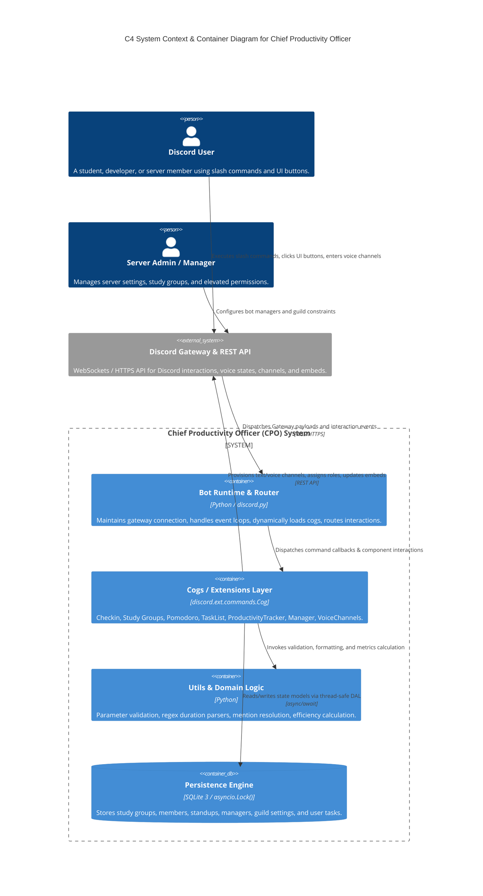
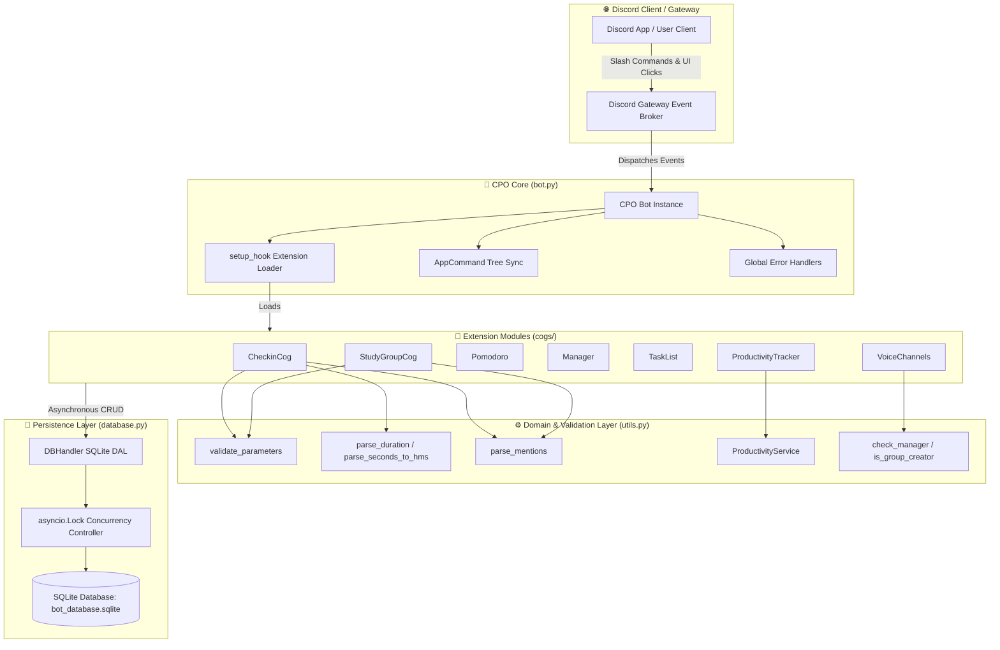
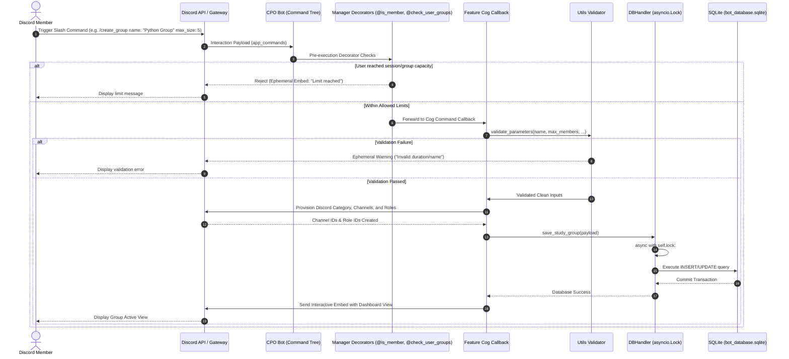
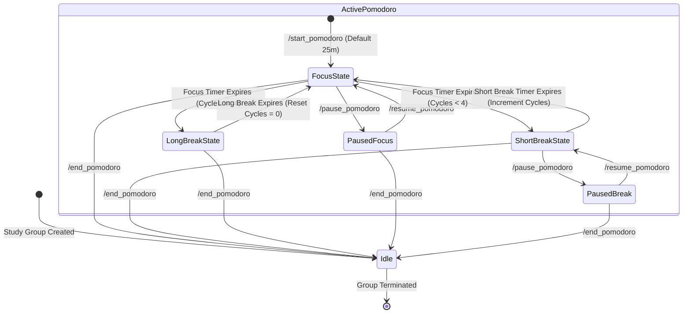
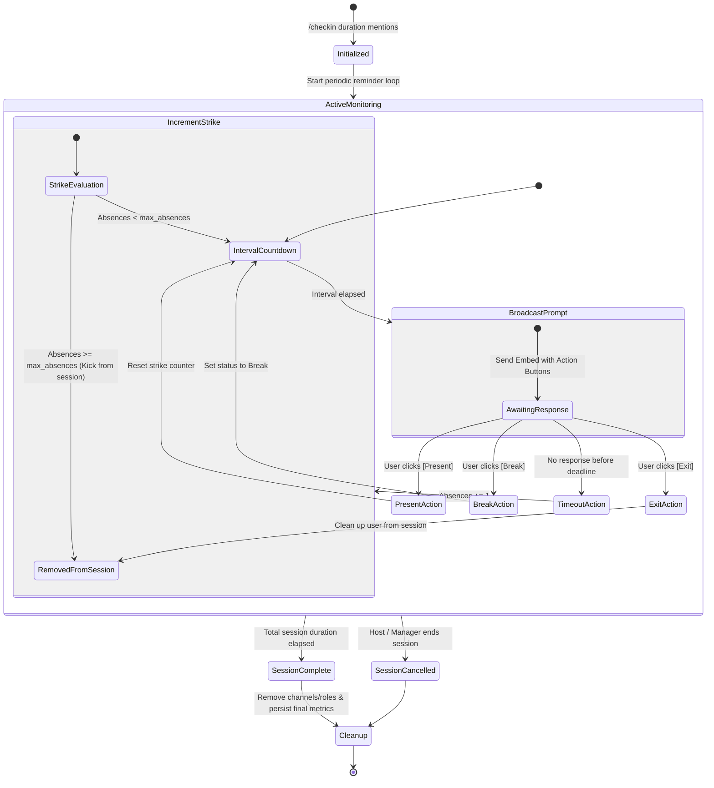
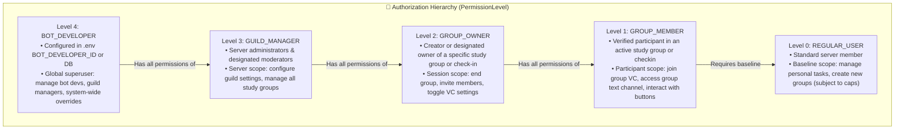
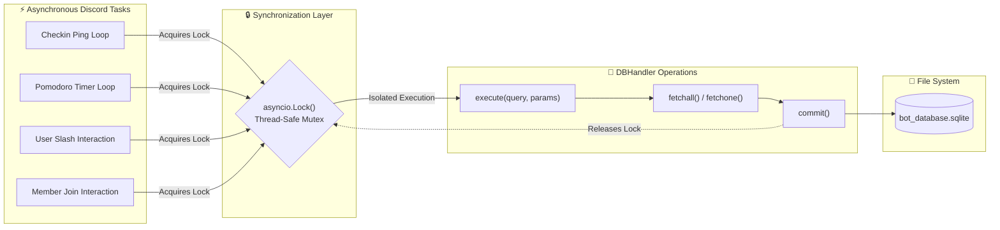

# Chief Productivity Officer (CPO) — Architecture & Technical Design

## 1. System Context & C4 Architecture Visualization

The **Chief Productivity Officer (CPO)** is an asynchronous, event-driven Discord application built on `discord.py` 2.4.x and Python 3.10+. It orchestrates productivity tools, collaborative study environments, Pomodoro focus cycles, standup check-ins, and personal task management across Discord guilds.

### 1.1 C4 Container Diagram



---

## 2. Component Topology & Structural Visualizations



---

## 3. Runtime Event & Interaction Pipelines

### 3.1 Slash Command Execution & Middleware Pipeline



---

## 4. State Transition Visualizations

### 4.1 Pomodoro Study Cycle State Machine



### 4.2 Checkin Standup Session State Machine



---

## 5. Security & Authorization Architecture

The authorization model implements a 5-tier Role-Based Access Control (RBAC) hierarchy defined in `cogs/manager.py`:



---

## 6. Concurrency & Persistence Isolation Model

Because SQLite is an embedded file-based database, concurrent writes from asynchronous Discord tasks must be coordinated to prevent database lock contention.



---

## 7. Logging & Observability Architecture

```mermaid
graph TD
    subgraph CodeModules ["📦 Codebase Modules"]
        M1[bot.py]
        M2[cogs/*.py]
        M3[database.py]
        M4[utils.py]
    end

    subgraph LoggerPipeline ["📝 Logging Pipeline (docs/LOGGING_STANDARDS.md)"]
        LInit["Module Loggers (logging.getLogger(__name__))"]
        Format["Structured Formatter: %(asctime)s - %(name)s - %(levelname)s - %(message)s"]
        Levels{"Log Level Filter"}
    end

    subgraph Sinks ["📊 Outputs & Diagnostics"]
        Console["Standard Output (Console)"]
        AppTreeError["Discord Error Embed (Interaction Ephemeral)"]
        AuditTrail["Database Table (voice_channel_logs)"]
    end

    CodeModules --> LInit
    LInit --> Format
    Format --> Levels
    Levels -->|DEBUG / INFO / WARNING / ERROR / CRITICAL| Console
    Levels -->|Unhandled AppCommand Errors| AppTreeError
    Levels -->|Voice Channel Creation Events| AuditTrail
---

## 8. Authorization Tiers & Slash Command Visibility Architecture

The CPO Bot implements a 3-tier authorization model mapped to Discord's native slash command visibility system:

```mermaid
graph TD
    subgraph Tiers ["🛡️ Authorization Hierarchy"]
        AdminTier["👑 ADMIN TIER (Levels 3 & 4)<br/>• Bot Developer (4)<br/>• Server Owner (3)<br/>• Server Administrator (3)"]
        ModTier["🛡️ MOD TIER (Level 2)<br/>• Server Moderators (perms & roles)<br/>• Study Group Owners<br/>• DB-Registered Moderators"]
        UserTier["👤 USER TIER (Levels 0 & 1)<br/>• Study Group Members (1)<br/>• Regular Server Members (0)"]
    end

    subgraph SlashVisibility ["👁️ Discord Slash Command UI Visibility"]
        AdminCmds["Admin Only (default_permissions: administrator=True)<br/>• /sync_commands<br/>• /sync_managers<br/>• /settings_checkin<br/>• /add_guild_manager<br/>• /remove_guild_manager<br/>• /add_bot_developer<br/>• /set_permission_level"]
        ModCmds["Mod/Admin Only (default_permissions: manage_guild / manage_channels)<br/>• /list_managers<br/>• /delete_vc<br/>• /delete_text_channel<br/>• /delete_role"]
        PublicCmds["Visible to All Server Members<br/>• /user_level<br/>• /create_group, /join_group, /leave_group<br/>• /task_add, /task_list, /task_complete<br/>• /productivity<br/>• /start_pomodoro, /pomodoro_status<br/>• /checkin"]
    end

    AdminTier -->|Can view & execute| AdminCmds
    AdminTier -->|Can view & execute| ModCmds
    AdminTier -->|Can view & execute| PublicCmds

    ModTier -->|Can view & execute| ModCmds
    ModTier -->|Can view & execute| PublicCmds
    ModTier -.->|Hidden in Discord UI| AdminCmds

    UserTier -->|Can view & execute| PublicCmds
    UserTier -.->|Hidden in Discord UI| ModCmds
    UserTier -.->|Hidden in Discord UI| AdminCmds
```

---

## 9. Directory & Module Reference

| Component | Path | Responsibility |
|---|---|---|
| **Core Entry Point** | [`bot.py`](file:///c:/Users/Vector/OneDrive/Desktop/CR/CPO/bot.py) | Bot lifecycle, cog discovery, tree synchronization, error listeners. |
| **Data Access Layer** | [`database.py`](file:///c:/Users/Vector/OneDrive/Desktop/CR/CPO/database.py) | SQLite schema creation, CRUD methods, `asyncio.Lock` concurrency. |
| **Domain Utilities** | [`utils.py`](file:///c:/Users/Vector/OneDrive/Desktop/CR/CPO/utils.py) | Parsing, input validation, permission predicates, `ProductivityService`. |
| **Check-in Standups** | [`cogs/checkin.py`](file:///c:/Users/Vector/OneDrive/Desktop/CR/CPO/cogs/checkin.py) | Time-boxed standup loops, status tracking buttons, strike counters. |
| **Study Groups** | [`cogs/study_groups.py`](file:///c:/Users/Vector/OneDrive/Desktop/CR/CPO/cogs/study_groups.py) | Channel and role provisioning, group dashboards, member limits. |
| **Pomodoro Timers** | [`cogs/pomodoro.py`](file:///c:/Users/Vector/OneDrive/Desktop/CR/CPO/cogs/pomodoro.py) | Focus/Break timer state machine and automatic VC movement. |
| **Role & Permission Manager** | [`cogs/manager.py`](file:///c:/Users/Vector/OneDrive/Desktop/CR/CPO/cogs/manager.py) | 5-tier authorization levels and session cap enforcement decorators. |
| **Personal Task List** | [`cogs/tasklist.py`](file:///c:/Users/Vector/OneDrive/Desktop/CR/CPO/cogs/tasklist.py) | Personal to-do list persistence and display. |
| **Productivity Tracker** | [`cogs/productivity_tracker.py`](file:///c:/Users/Vector/OneDrive/Desktop/CR/CPO/cogs/productivity_tracker.py) | Metric aggregation and embed presentation. |
| **Voice Channels** | [`cogs/voice_channels.py`](file:///c:/Users/Vector/OneDrive/Desktop/CR/CPO/cogs/voice_channels.py) | Dedicated VC provisioning and cleanup. |
| **Knowledge Graph** | [`KNOWLEDGE_GRAPH.md`](file:///c:/Users/Vector/OneDrive/Desktop/CR/CPO/KNOWLEDGE_GRAPH.md) | Architectural and semantic entity relationship graph. |
| **Machine Graph** | [`knowledge_graph.json`](file:///c:/Users/Vector/OneDrive/Desktop/CR/CPO/knowledge_graph.json) | Machine-readable ontology for LLM indexing. |
| **Agent Playbook** | [`AGENTS.md`](file:///c:/Users/Vector/OneDrive/Desktop/CR/CPO/AGENTS.md) | Developer and autonomous agent operating manual. |
| **Changelog** | [`CHANGELOG.md`](file:///c:/Users/Vector/OneDrive/Desktop/CR/CPO/CHANGELOG.md) | Semantic versioning change ledger. |
| **Logging Standards** | [`docs/LOGGING_STANDARDS.md`](file:///c:/Users/Vector/OneDrive/Desktop/CR/CPO/docs/LOGGING_STANDARDS.md) | Structured logging and observability specification. |
