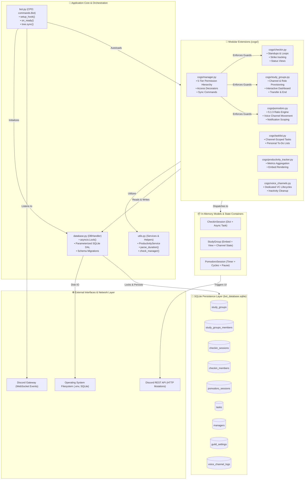
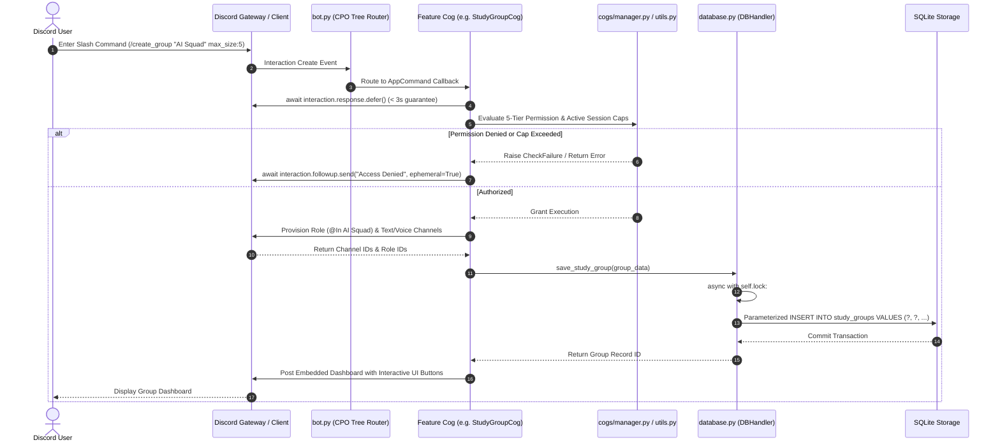
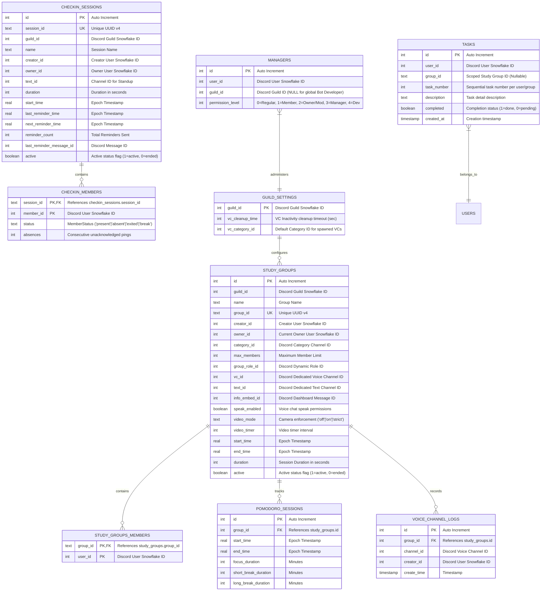
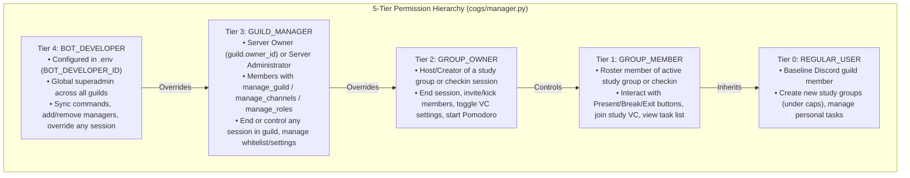

# Chief Productivity Officer (CPO) — Knowledge Graph & Semantic Architecture

This document provides a formal, comprehensive Knowledge Graph and architectural mapping of the **Chief Productivity Officer (CPO)** Discord bot repository. It maps directory boundaries, component topologies, execution lifecycles, state invariants, database schemas, and external dependencies to enable autonomous AI agents and engineers to navigate, reason about, and modify the codebase with precision.

---

## 1. Directory Topology & System Boundaries

```
Chief-Productivity-Officer/
├── bot.py                     # [Entry Point] Bot client lifecycle, extension loader, tree syncing
├── database.py                # [Persistence DAL] Thread-safe SQLite access layer (asyncio.Lock)
├── utils.py                   # [Core Utilities] Time/regex parsers, permission checks, ProductivityService
├── pyproject.toml             # [Toolchain Config] Packaging metadata, pytest, ruff, mypy settings
├── requirements.txt           # [Dependencies] Production runtime dependencies
├── requirements-dev.txt       # [Dependencies] Testing, linting, and type checking tools
├── .env.example               # [Config Template] Template for bot tokens, developer IDs, and settings
├── .gitignore                 # [VCS Filters] Git exclusion rules (safeguards DBs, caches, env)
├── AGENTS.md                  # [Agent Manual] Autonomous operations playbook, toolchain, and guardrails
├── ARCHITECTURE.md            # [System Design] C4 architectural models, state transitions, lifecycles
├── CHANGELOG.md               # [Audit Trail] Keep-a-Changelog semantic versioning ledger
├── KNOWN_ISSUES.md            # [Defect Register] Technical debt, active bugs, and architectural risks
├── TODO.md                    # [Backlog] Prioritized operational and engineering tasks (P0–P2, Backlog)
├── commands.md                # [User Manual] Complete Discord slash command reference guide
├── cogs/                      # [Feature Extensions] Modular Discord extension modules
│   ├── checkin.py             # Standup check-in sessions, periodic ping loops, attendance UI
│   ├── study_groups.py        # Dedicated study rooms, dynamic role/channel provisioning, dashboard
│   ├── pomodoro.py            # Focus/Break timer state machine, VC auto-move, 5:1:3 ratio calculation
│   ├── manager.py             # 5-tier permission hierarchy, session limits, command authorization
│   ├── tasklist.py            # Personal task CRUD with channel-aware study group scoping
│   ├── productivity_tracker.py# Productivity metrics calculation and Discord embed formatting
│   └── voice_channels.py      # Dedicated voice channel provisioning and lifecycle cleanup
├── tests/                     # [Verification Suite] Offline mock-safe unit tests
│   ├── test_database.py       # Direct SQLite DAL transaction and CRUD tests
│   ├── test_new_features.py   # Pomodoro ratios, channel scoping, and permission matrix tests
│   ├── test_productivity_tracker.py # Productivity metric and embed calculation tests
│   ├── test_tasklist.py       # Task list creation and completion logic tests
│   └── test_utils.py          # Time parser and validation utility tests
└── docs/                      # [Developer Documentation]
    ├── LOGGING_STANDARDS.md   # Structured logging conventions and rules
    ├── commands.md            # Supplemental command syntax notes
    └── readme.md              # Documentation summary
```

### High-Level Topology & Component Architecture



---

## 2. Data & Execution Flow Lifecycles

### Primary Execution Lifecycle: Slash Command to Database & Discord API



### Background Execution Lifecycle: Periodic Check-in Loop & Strike Evaluation

```mermaid
sequenceDiagram
    autonumber
    participant Loop as CheckinSession Background Loop (asyncio.sleep)
    participant Cog as cogs/checkin.py
    participant Discord as Discord REST API
    participant DB as database.py
    actor Member as Guild Member

    loop Every Reminder Interval (e.g. 15m)
        Loop->>Cog: Reminder Interval Timer Expired
        Cog->>Discord: Send Standup Ping with Present / Break / Exit Buttons
        Discord-->>Member: Render Notification & Component View
        alt Member Clicks Present
            Member->>Discord: Button Interaction Callback
            Discord->>Cog: Member Status Updated: 'present'
            Cog->>DB: add_or_update_checkin_member(absences=0)
        else Member Clicks Break
            Member->>Discord: Button Interaction Callback
            Discord->>Cog: Member Status Updated: 'break'
            Cog->>DB: add_or_update_checkin_member(status='break')
        else Timeout with No Interaction
            Loop->>Cog: Attendance Window Closed
            Cog->>DB: Increment Absences Count (+1)
            alt Absences >= max_absences (Strike Limit)
                Cog->>Discord: Send Strike Warning / Remove Member from Session
                Cog->>DB: Update Member Record ('exited')
            end
        end
    end
```

---

## 3. Database Entity-Relationship (ER) Schema



---

## 4. State & Invariants

| Component | State Medium | Concurrency & Sync Mechanism | Invariant Rules |
|---|---|---|---|
| **Study Groups** | In-Memory (`StudyGroupCog.sessions`) & SQLite (`study_groups`) | Synchronized during lifecycle events; hydrated from SQLite on startup. | An active study group must hold valid `text_id`, `vc_id`, and `group_role_id`. When terminated, channels and roles must be deleted, `active` set to `0`, and memory references popped. |
| **Pomodoro Engine** | In-Memory (`Pomodoro.sessions`) & SQLite (`pomodoro_sessions`) | Tick evaluation via background loop; notifications routed to channel. | The ratio between Focus, Short Break, and Long Break must strictly obey `(focus, focus // 5, focus * 3 // 5)`. After 4 cycles, Long Break is enforced. |
| **Check-in Standups** | In-Memory (`CheckinCog.active_sessions`) & SQLite (`checkin_sessions`) | Periodic `asyncio.sleep` reminder loop with member state dict. | Member absences cannot be negative. If absences exceed `max_absences`, member status transitions to `exited` or is kicked from group. |
| **Task Lists** | SQLite (`tasks`) | Atomic parameterized SQL queries under `async with self.lock:`. | If invoked inside a study group channel (`channel_id`), tasks are strictly scoped to `group_id`. Global tasks are isolated from group tasks. |
| **Permission Controls** | Memory Cache & SQLite (`managers`) | Dynamic permission resolution cascading across 5 tiers. | Superuser `BOT_DEVELOPER` (ID in `.env`) unconditionally overrides all guild-level and group-level permissions. |
| **Database Access Layer** | Thread-Safe DAL (`DBHandler`) | All reads and writes wrapped in `async with self.lock:`. | No unparameterized queries. `sqlite3.Row` factory enabled for dict-like key access. |

---

## 5. External Dependencies & Integration Points

| Dependency | Category | Role in System | Failure Modes & Mitigations |
|---|---|---|---|
| **Discord Gateway (WebSocket)** | External Service | Real-time event streaming (`INTERACTION_CREATE`, `VOICE_STATE_UPDATE`). | Connection drops handled by discord.py auto-reconnect; sessions persist in SQLite. |
| **Discord REST API (HTTP)** | External Service | Channel/Role provisioning, embed sending, permissions modification. | Rate limits (HTTP 429) mitigated by interaction deferral and pacing. Embeds capped at 25 fields to avoid HTTP 400. |
| **SQLite 3 (`bot_database.sqlite`)** | Local Storage | Structured relational data store for all persistent state. | File corruption or contention mitigated by `asyncio.Lock()` serializing transactions. |
| **Python Standard Library `audioop`** | Native Runtime | Used internally by Discord voice audio subsystem. | Deprecated in Python 3.13; currently emitting a warning on Python 3.12. |
| **Environment Variables (`.env`)** | Configuration | Supplies `DISCORD_BOT_TOKEN`, `BOT_DEVELOPER_ID`, `DB_NAME`. | Missing token halts boot in `bot.py` with explicit configuration error. |

---

## 6. Permission Hierarchy Model


